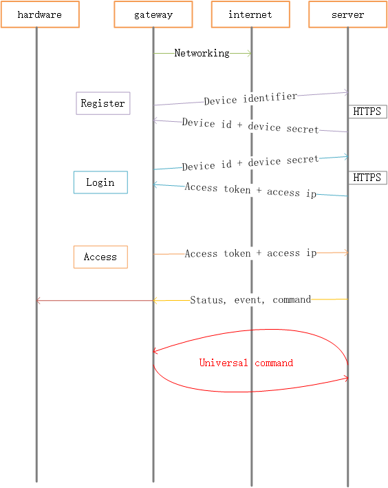
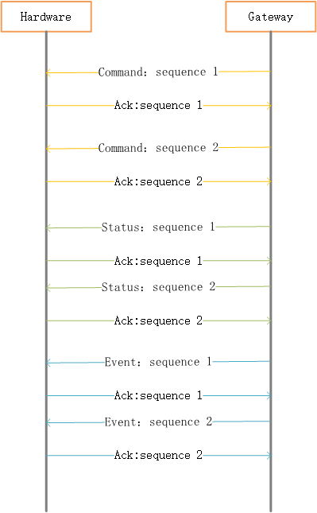
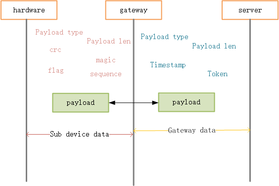

# Pando Protocol

Pando protocol是Pando物联网解决方案中的协议部分。  
这里主要介绍Pando协议的整体构成，包括设备与服务器的认证和接入流程，协议数据包的构成，以及通讯过程中数据成员的定义。  
[English Document](doc/english-document.md)

# 目录  
* [Pando协议目标](#Pando协议目标)
* [名词解释](#名词解释)  
* [协议介绍](#协议介绍)  
* [协议分层](#协议分层)  
* [基本协议流程](#基本协议流程)  
* [数据包交互](#数据包交互)  
* [协议数据包结构](#协议数据包结构)  
* [数据结构](#数据结构)
* [快速开始](#快速开始)
* [贡献项目](#贡献项目)

## Pando协议的目标

Pando协议定义了一套简单、统一的通信流程与数据包格式，实现不同厂商的设备、云平台之间通信的兼容性。  

## 名词解释  
子设备：sub device，通常指(但不仅限)硬件层的控制器，也可以指软件虚拟的硬件层设备。  
网关： gateway，通常指接入节点，负责转发子设备和服务器的协议数据，用于接入internet。  
设备：设备由网关和若干个子设备组成，最终以产品的形式呈现给用户。      
服务器： 实现了pando物联网协议的云端服务器。  
命令：command,外界对本地信息处理提出的要求，例如服务器下发命令重启设备    
事件：event, 本地通知外界关注的、处理后的、有效信息,例如温度控制器上报的高温异常事件      
状态：status,当前信息的描述参数，比如湿度控制器上报的当前湿度值    

## 协议介绍   
1. pando协议定义了一套统一的认证和接入流程，不同的设备只要遵循这套流程，就能接入云端服务器进行业务通信。  
2. pando协议定义了统一的业务数据包内容的规范，但没有规定数据包的编码方式。  
3. pando协议可使用不同的通信协议进行数据传输。只要服务器端和设备端使用相同的通信协议即可完成业务数据的传输与解析。  
可以采用COAP协议、自定义二进制传输协议，可根据不同的场景选择通信协议。
目前基于“MQTT协议”实现业务数据包的传输。MQTT协议是现阶段比较合适物联网的协议方案，可以在低带宽和不稳定的网络条件下保证通信的稳定。    

## 协议分层
协议分为三层，如下图所示

协议需在接入层和硬件层实现  
### 1. 接入层

接入层分为云服务器和网关，其中接入设备的形态不一，网络的连接方式可以是wifi、3G等，主要负责连接internet，将数据包转发至云端服务器。
### 2. 硬件层
硬件层实现子设备，将数据传递至网关，数据传递的方式有串口、SPI、USB、蓝牙等。

## 三、 基本协议流程
本节介绍设备在已连网的情况下，如何与服务器完成注册、登陆认证、接入传输数据等流程。 
总体流程示意如下图所示  
 
 
### 1. 联网：   
开始所有流程前，必须保证设备已接入internet。  
### 2. 注册：  
1. 查看本地配置，是否有device id以及device key配置。如果有，则设备已经注册成功了，退出注册流程；否则继续。  
2. 从设备本地读取product key和网关序列号。      
4. 以 product key, SN, 版本为参数，通过http api向服务器注册设备，等待服务器注册结果。  
5. 服务器会校验product key是否合法，如果注册成功，则会返回一个device id和device secret。如果注册失败，回到步骤4一直重试，直到成功为止。  

### 3. 登陆  
1. 查看本地配置，获取device id及device secret。如果没有，返回至注册流程。 
2. 通过[http api](doc/http-api.md)向服务器验证device id和device secret。如果成功，服务器会返回device token以及access address；如果服务器返回失败，说明device id和device secret已失效，需要删除本地device id和device secret，重新进入注册流程。如果是服务器不可用或者超时，则一直重试，直到成功为止。  

### 4. 接入    
1. 接入流程的细节与通信协议有关， 设备以指定的通信协议连接至服务器(access address)。  
2. 接入时必须上报device token和device id.   
一方面，服务使用device id区分当前是哪个设备尝试接入；另一方面，服务器会进行校验device token和device id，通过校验后才能进行后续的信息交互。  
接入流程中和服务器的任何数据流交互必须校验设备token（包括服务器和设备都需要对协议包中的token字段进行比对校验，如果不合法则应该丢弃）。  
3. 设备接入后，不同类型的设备，要以不同频率持续向服务器发送心跳包   
4. 在token过期的情况下，服务器会关闭连接或向设备发送“重新登陆”的指令，网关收到后重新进入登陆流程，获取新的token。  
5. 当设备发现上次心跳发送失败时，重新进入接入流程。  

## 四、数据包交互  
设备完成接入流程后，开始信息的交互，包括状态、数据、事件。  
### 1. 信息的传递的两个阶段：  
* **设备和硬件子设备之间**  
受硬件子设备性能所限，包括运算性能、内存、传输带宽等，这阶段使用较为紧凑的二进制数据包形式进行传输。  
数据通过串口，蓝牙，I2C等接口传输，传输路径较短，数据丢失损坏的概率较小，因此没有涉及复杂的校验机制。   
目前仅使用了crc校验确定数据的完整，采用sequence、ack的方式保证数据的可靠到达。
如下图所示，接收方需要回复ack包进行确认，要求回复的sequence与收到的一致。如果发送方没有收到ack，则重发数据包，尝试3次后不再重传。  
指令、状态、事件拥有独立的sequence，每发一个包递增1，重传数据包时sequence不变。  
     
实际情况还是需要一种简单，可移植，开销小的通信机制保证数据的完整性【待实现】。  
  
* **设备和服务器之间**  
internet网络环境非常复杂，进行数据传输时，必须有多种机制保证数据传输的安全及完整性。  
目前使用ssl连接、mqtt协议、token校验三种方式保证数据的可靠送达。  

### 2. 数据包内容  
* **关键信息：传输过程中无需转换**  
sub device id: 子设备id。一个网关拥有多个子设备，id用于表示数据包归属于哪个子设备  
command num,event num:指令编号、事件编号  
property num: 数据的属性编号  
tlv: type, length, value的缩写，type表示value的数据类型，length则表示value(bytes, string这种无类型长度的数据)的具体长度。tlv保存了指令、事件、状态属性的参数。    
* **辅助信息：网关会根据场景进行转换**   
**网关**  
device id:设备id，由服务器分配的唯一的id  
timestamp：时间戳，由网关产生，指示数据包的生成时间  
token：用于服务器和网关校验数据包的来源，保证安全性    
payload type：表示数据包类型  
payload length：表示数据包携带的关键信息的长度  
**硬件子设备**  
payload type：表示数据包类型  
payload length：表示数据包携带的关键信息的长度  
magic：魔数，位于包起始位置  
crc：数据包校验和  
frame sequence：数据包序号，用于重传   
flag：用于未来协议扩展  

### 3. 数据包的转换  
根据数据包传输的两个阶段和数据成员的意义，网关需要进行数据包转换。  
其中，转换辅助信息即可，不需要转换关键信息。因为网关无需理解关键信息，只要保证关键信息安全可靠的送达服务器。  
不转换关键信息，可一定程度较少网关的开销。  
如下图所示，数据包传输的过程中，网关进行二进制和mqtt数据包的转换。    
   

### 4. 设备与硬件子设备的形式  
  这里要指出一点，接入设备与硬件层的设备，可以分别是两个实体设备，也可以只有一个实体设备，接入设备和硬件层的软件都在该设备上运行。例如：  
  * ESP8266作为接入设备，STM32作为硬件层设备，两者之间通过串口进行通信；  
  * ESP8266作为接入设备，同时自己又充当一个硬件层设备，通过GPIO控制外围接口(GPIO等)；   
  * 选择3G模块作为接入internet的通道时，由于3G模块上无法运行自己的软件，只能通过AT指令进行通信。此时选择STM32作为硬件层设备，同时需要在上面运行接入设备的软件。  

### 5. 平台通用的指令和事件  
服务器会操作维护网关的一些状态，为了实现这个目的，定义了[平台通用的指令和事件](doc/universal-event-and-command.md) 。  
网关的程序需要实现一个虚拟的硬件子设备，来实现这些通用指令和事件。   

## 数据结构  
[C语言-MQTT实现](doc/c-mqtt-implementation.md)  

## 快速开始

本项目描述了协议的设计与内容，协议在不同平台的实现在项目[pando-embedded-framework](https://github.com/PandoCloud/pando-embedded-framework)。可通过该项目的linux实现，结合本项目的文档，快速了解协议的细节。

## 贡献项目
* **反馈问题**：我们鼓励通过[提交Issue](https://github.com/PandoCloud/pando-protocol/issues/new)的方式反馈您在了解协议过程中遇到的疑问或问题。
* **提出建议**：同样，可以通过[提交Issue](https://github.com/PandoCloud/pando-protocol/issues/new)向我们提供协议改进意见，同时可以通过加入我们的讨论QQ群（488074716）或者参加我们主办的线下物联网技术沙龙一起讨论。
* **贡献代码**：非常欢迎有能力的朋友一起参与Pando物联网平台的开发，一起构建开放、免费、开源的物联网解决方案。请按照[贡献流程](./docs/zh-cn/contribution/work-flow.md)参与项目开发。
